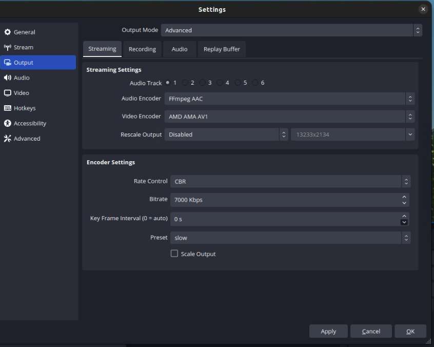
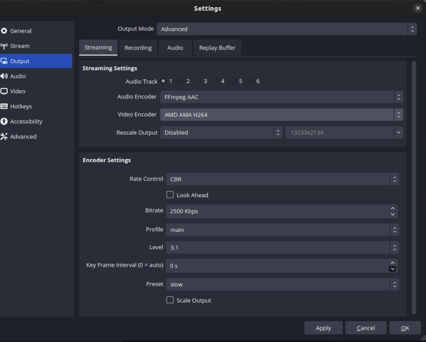
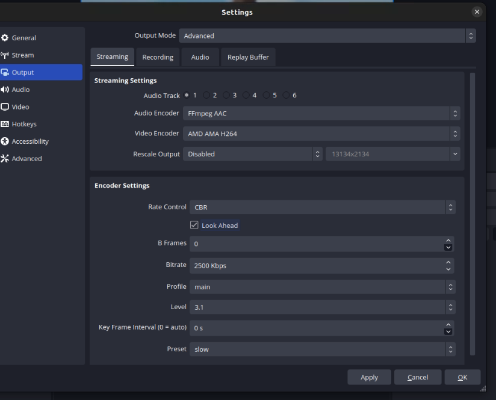
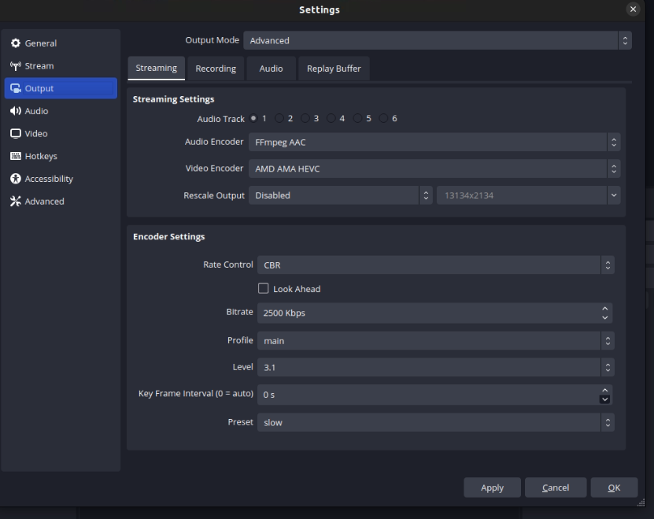

# OBS AMD AMA Plugin

## Introduction

Enables Hardware Acceleration encoding in AVC/H.264, HEVC/H.265 and AV1 using the AMD Alveo™️ MA35D.

#### It also includes:

* A CMake project file
* GitHub Actions workflows and repository actions

## Set Up

### Pre Requisites

In order to use the plugin it is necessary to have the following requirements on your PC:

* Linux Ubuntu 22.04 OS with Kernel version 5.15.0-92 or greater
* At least one AMD Alveo™️ MA35D hardware acceleration card
* AMD AMA SDK 1.1.2 or greater installed, for intructions on installing the SDK follow the instructions from the following [link](https://amd.github.io/ama-sdk/v1.1.1/getting_started_on_prem.html)
* OBS Studio version 30.0 or greater installed via PPA
* If you want to build the plugin you will need additional requirements which are listed and explained on the Build Plugin section. Also you can follow the instructions from OBS Studio Wiki using the following [link](https://github.com/obsproject/obs-studio/wiki/Build-Instructions-For-Linux).

### Before launching OBS

It is necessary to do some additional configurations on your PC before launching OBS and using the plugin:

For AMD Alveo™️ MA35D card to work properly it is necessary to run a setup script that sets some necessary environment variables. This script is added to your pc when installing AMD AMA SDK, to run the script there are different approaches you can take: 

* The easiest method is to configure your bash profile, for this purpose open the file `/etc/profile` and add the following line at the end of this file:

`source /opt/amd/ama/ma35/scripts/setup.sh`

* Alternatively you can run the same command every time you open a new terminal and afterwards launch OBS from that same terminal.

## Installation

The plugin can be installed using dpkg command once you have the plugin package, to install the package run the following command:

`dpkg -i obs-amd-ama-plugin.deb`

After running command, AMD AMA Plugin features should be available when launching OBS.

## Build Plugin

### Install dependencies: 

* The dependencies for building the plugin are installed via `apt`. If your OS and kernel version are the ones mentioned on the section Set Up the version of the libraries to be installed will be the correct ones.

    * Build system dependencies
    ```
    sudo apt install cmake ninja-build pkg-config clang clang-format build-essential curl ccache git zsh
    ```

    * OBS dependencies (core):
    ```
    sudo apt install libavcodec-dev libavdevice-dev libavfilter-dev libavformat-dev libavutil-dev libswresample-dev libswscale-dev libx264-dev libcurl4-openssl-dev libmbedtls-dev libgl1-mesa-dev libjansson-dev libluajit-5.1-dev python3-dev libx11-dev libxcb-randr0-dev libxcb-shm0-dev libxcb-xinerama0-dev libxcb-composite0-dev libxcomposite-dev libxinerama-dev libxcb1-dev libx11-xcb-dev libxcb-xfixes0-dev swig libcmocka-dev libxss-dev libglvnd-dev libgles2-mesa libgles2-mesa-dev libwayland-dev libvpl2 libsrt-openssl-dev libpci-dev libpipewire-0.3-dev libqrcodegencpp-dev
    ```

    * OBS Qt6 dependencies (UI):
    ```
    sudo apt install \
           qt6-base-dev \
           qt6-base-private-dev \
           libqt6svg6-dev \
           qt6-wayland \
           qt6-image-formats-plugins
    ```

    * Plugin dependencies:
    ```
    sudo apt install \
           libasound2-dev \
           libfdk-aac-dev \
           libfontconfig-dev \
           libfreetype6-dev \
           libjack-jackd2-dev \
           libpulse-dev libsndio-dev \
           libspeexdsp-dev \
           libudev-dev \
           libv4l-dev \
           libva-dev \
           libvlc-dev \
           libvpl-dev \
           libdrm-dev \
           nlohmann-json3-dev \
           libwebsocketpp-dev \
           libasio-dev
    ```

### Build
Once you install the dependencies of the section above, to build the plugin run the following commands from the plugin main directory:

* `cd .github/scripts`
* `./build-linux`

After running these two commands you will have a build folder named `build_x86_64`, particularly this folder will contain the shared object associated with the plugin `obs-amd-ama.so`. If you want to create a `.deb` package of the plugin you can run the following command in the plugin main directory:

`cmake --build build_x86_64 --target package`

## Usage

### AV1
#### Params:
* Rate control: Rate control mode for custom rate control Supported values are CQP, CBR and CRF.
* Bitrate: Bitrate of output data (in kbps). Max: 3500000
* Key frame interval: Inserts a key frame using the interval configured. If 0 it inserts a keyframe every 2 seconds.
* Preset: Encoder VQ-Density preset. Valid values: fast, medium or slow. (default is medium).
  - (fast) Allows for increase in total throughput from 4kp60 to 4kp75 , when 2 or more channels are used. Does not apply to AV1 -type 1 encoding. Not applicable under ULL setting. Note lower VQ than medium preset is to be expected.
  - (medium) Full density with medium VQ - default
  - (slow) High VQ at lower density. Applicable to 10 bit contents only.




### AVC/H.264 & HEVC/H.265
#### Params:
* Rate control: Rate control mode for custom rate control Supported values are CQP, CBR and CRF.
* Look Ahead: Enables look ahead and shows the bframe config.
  - B Frames: Number of B frames. Valid values for H.264 and HEVC: 0-3
* Bitrate: Bitrate of output data (in kbps). Max: 3500000
* Profile: Encoding profile. Valid values are: 
  - 0 (Baseline), 1 (Main), 2 (High), 3 (High 10), or 4 (High 10 Intra) for H.264 
  - 100 (Main), 101 (Main Intra), 102 (Main 10), or 103 (Main 10 Intra) for HEVC 
  - -1 (Auto) for any codec.
* Level: Encoding level restriction
  - Valid values for H.264: 1, 1.1, 1.2, 1.3, 2, 2.1, 2.2, 3, 3.1, 3.2, 4, 4.1, 4.2, 5, 5.1, 5.2 6, 6.1, 6.2
  - Valid values for HEVC: 1, 2, 2.1, 3, 3.1, 4, 4.1, 5, 5.1,5.2, 6, 6.1, 6.2
* Key frame interval: Inserts a key frame using the interval configured. If 0 it inserts a keyframe every 2 seconds.
* Preset: Encoder VQ-Density preset. Valid values: fast, medium or slow. (default is medium).
  - (fast) Allows for increase in total throughput from 4kp60 to 4kp75 , when 2 or more channels are used. Does not apply to AV1 -type 1 encoding. Not applicable under ULL setting. Note lower VQ than medium preset is to be expected.
  - (medium) Full density with medium VQ - default
  - (slow) High VQ at lower density. Applicable to 10 bit contents only.







## Known Limitations

This plugin has the following limitations:

* The plugin only works with a PPA OBS Studio installation, it is not compatible with a Flatpack installation.

* It is not possible for the user to select the amount of B frames for the encoding when using AV1, the amount of B frames is selected by the plugin taking into account the characteristics of the stream or recording to be created.

* The only possible input pixel format for this plugin is I42O. If another pixel format is selected by the user, the plugin will convert it to I420 format. 

* It is not currently possible to change encoder settings while doing streaming. If the user needs to change encoding settings, it must stop the streaming, change the encoding settings and start again the stream.

